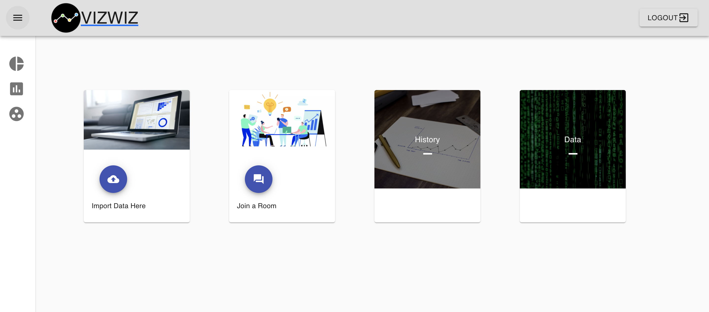
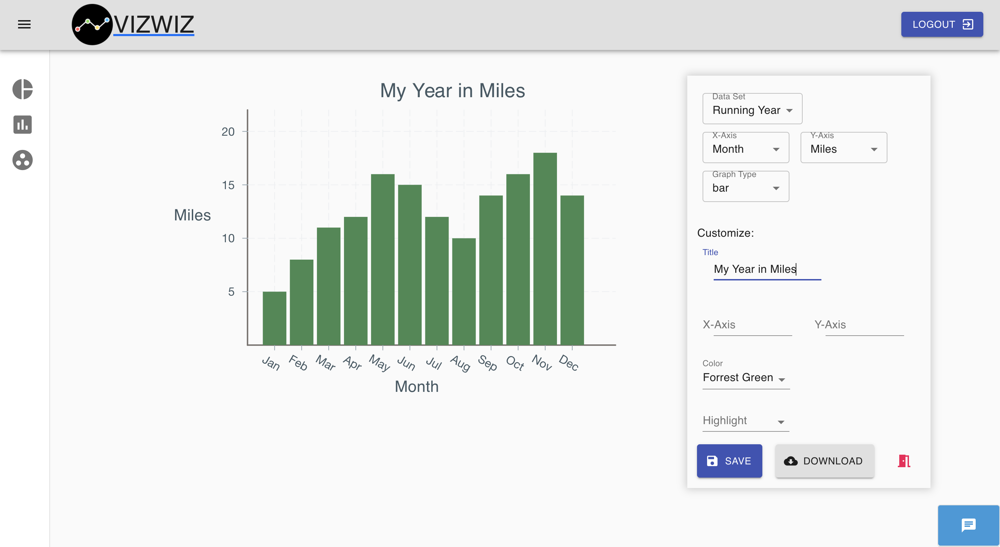
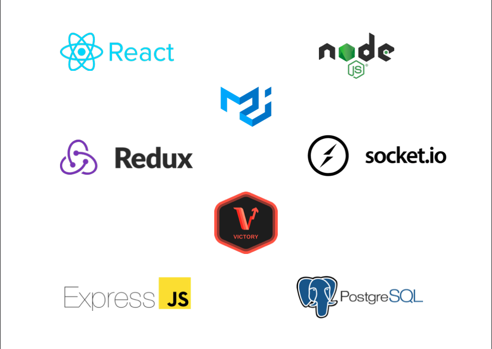

## VizWiz 

VizWiz is a data visualization dashboard for uploading data, creating graphs, and saving the created graphs. Collaborate with others to create visually stunning graphs and charts without the hassle of working with a spreadsheet program. This application will turn you into a Vizualization Wizard!
 
 

 

Check out demo video here -> ...

 
 

 
 

 
 

  ## Deployed at
 https://vizwiz.herokuapp.com/
  
  

 ## Technologies Used
To build this application, we used JavaScript, Victory JS, Node.js, React/Redux, Express, Postgres, Socket io, and MaterialUI.

 
 

 

## Getting Started

1. Clone this repo
2. `npm install`
3. Read this `README.md` 
4. `createdb VizWiz`
5. Start the build process and your application with: `npm run start:dev`. 
5. Seed database by executing `npm run seed`

  

## Brought to you by:
- [Isabelle Nelson](https://www.linkedin.com/in/isabellenoelnelson/)
- [Jack Chen](https://www.linkedin.com/in/jaeke-c/)
- [Kevin Kim](https://www.linkedin.com/in/kevin-k-/)
- [Jeanette Abell](https://www.linkedin.com/in/jeanetteabell/)
 

## Future improvement considerations for VizWiz
1. ...

